# HEALTHCARE-DATA-ANALYSIS:DIABETES-STUDY
End-to-end data analysis of diabetes hospital readmission data using Python, including data cleaning, exploratory data analysis (EDA) with Pandas, and interactive visualizations with Matplotlib, Seaborn, and Plotly.

## 1. Project Overview
This project presents an end-to-end healthcare data analysis of diabetes patient records. The objective is to explore patient demographics, hospital admissions, length of stay, and readmission patterns to uncover meaningful insights that can support healthcare decision-making.
The project demonstrates the complete data analysis workflow, including data cleaning, preprocessing, exploratory data analysis (EDA), visualization, and interpretation of results using Python.

## 2. Tools Used
**• Pandas**– Data cleaning and manipulation

**• Matplotlib** – Basic data visualization

**• Seaborn** – Advanced and statistical visualizations

**• Plotly** - Interactive, web-based data visualizations

## 3. Dataset
**• Source:** UCI Machine Learning Repository

**• Description:** The dataset contains Diabetic patient's information with the following key columns:

o age_group	

o gender

o admission_type

o discharge_disposition

o admission_source

o time_in_hospital

o number_medications	

o number_lab_procedures

o number_diagnoses

o HbA1c_result

o glucose_serum_result

o readmitted    etc.

## 4. Steps Followed
1. Imported the dataset using Pandas.
   
2. Cleaned and preprocessed the data by:
   
      o Handling missing values.

      o Renaming and standardizing column names.

      o Mapping coded values to meaningful categories (e.g., admission type, discharge disposition, admission source).

      o Converting data types where necessary.

      o Removing invalid records (e.g., Unknown/Invalid values in the gender column).

3. Performed Exploratory Data Analysis (EDA) using Pandas to examine patient demographics, clinical indicators, hospitalization patterns, and readmission trends.
   
4. Created visualizations using Matplotlib, Seaborn, and Plotly, including:

      o Bar charts for patient demographics and admission types.

      o Count plots for readmission analysis.

      o Box plots for hospitalization trends.

      o Pie charts for categorical distributions.

      o Pair plots to explore relationships between numerical variables.

      o Interactive Plotly charts for enhanced data exploration.

5. Analyzed the visualizations and extracted meaningful insights on diabetes patient characteristics, hospital stay duration, clinical indicators, medication usage, and readmission patterns to support data-driven healthcare decisions.

## 5. Key Insights

* Most diabetes patients were **not readmitted** after discharge, indicating that the majority of hospital visits did not result in a follow-up admission.

* Among readmitted patients, **readmissions after 30 days (`>30`) were more common** than readmissions within 30 days (`<30`).

* Patients aged **60–80 years represented the largest proportion of hospital admissions**, showing that older adults were the most frequently hospitalized group.

* **Emergency admissions accounted for the highest number of hospitalizations and readmissions**, suggesting that acute conditions were a major factor in diabetes-related hospital visits.

* Patients with **abnormal HbA1c (`HbA1C_result`) and elevated glucose serum (`glucose_serum_result`) results** showed greater healthcare utilization, including longer hospital stays and higher readmission occurrence.

* Male and female patients displayed **similar readmission patterns**, indicating that gender had only a limited impact on readmission outcomes in this dataset.

* Patients with a **higher number of medications and diagnoses generally experienced longer hospital stays**, suggesting that increased clinical complexity was associated with greater healthcare resource utilization.

## 6. Visualizations

The project includes various visualizations to analyze diabetes patient characteristics, hospitalization patterns, and readmission trends.

• Pie charts representing categorical distributions such as readmission status. 
 
• Bar charts showing patient distribution across age groups, gender, and admission types.

• Count plots analyzing readmission patterns and relationships with patient attributes.

• Histogram displaying the distribution of hospital stay duration to understand the frequency and variation of patient hospital stays. 

• Box plot comparing hospital stay duration across different readmission categories to identify variations in length of stay. 

• Violin plot showing the distribution of hospital stay duration across different age groups to analyze variations and spread of hospitalization duration      among patient age categories. 

• Tree map representing categorical distributions such as admission type. 

• Pair plots exploring relationships between numerical healthcare variables. 

• Interactive Plotly charts for enhanced exploration of healthcare data patterns.

### Screenshots
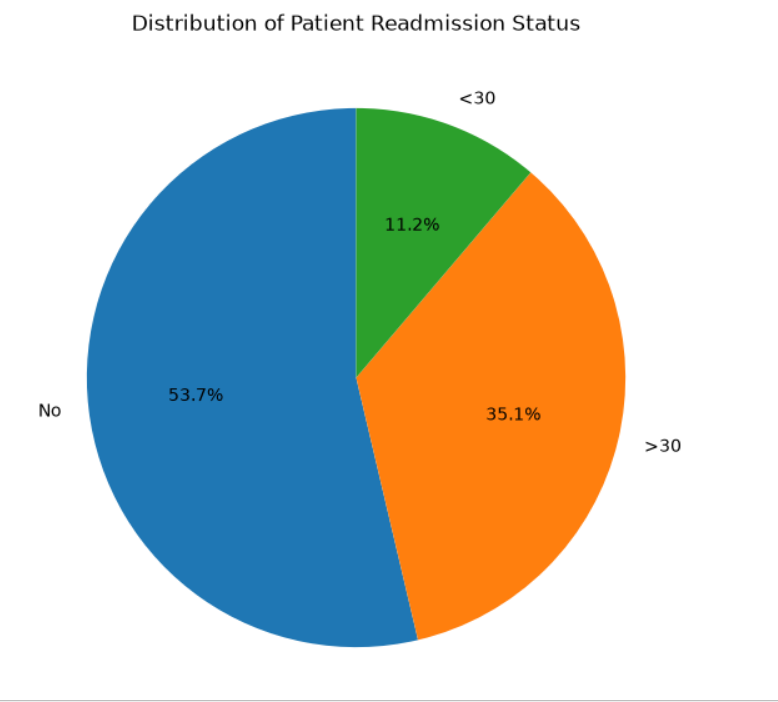

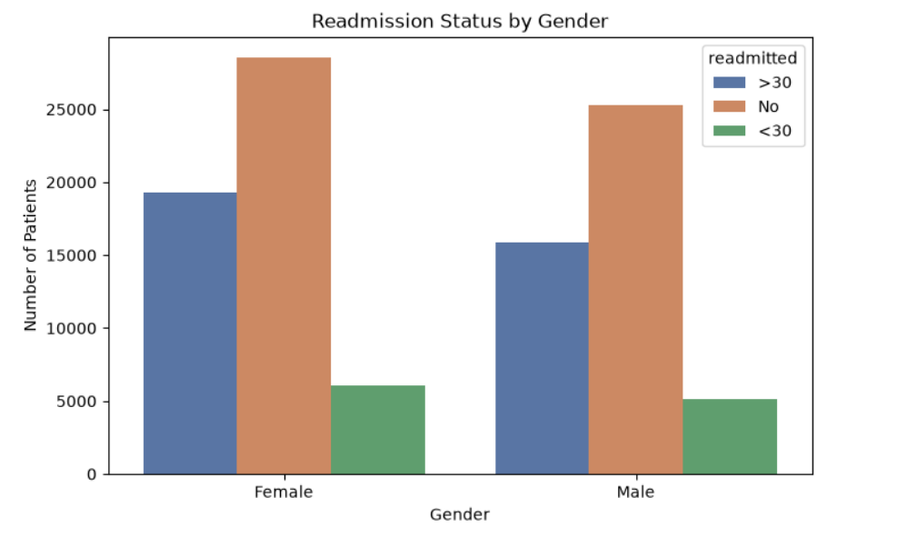

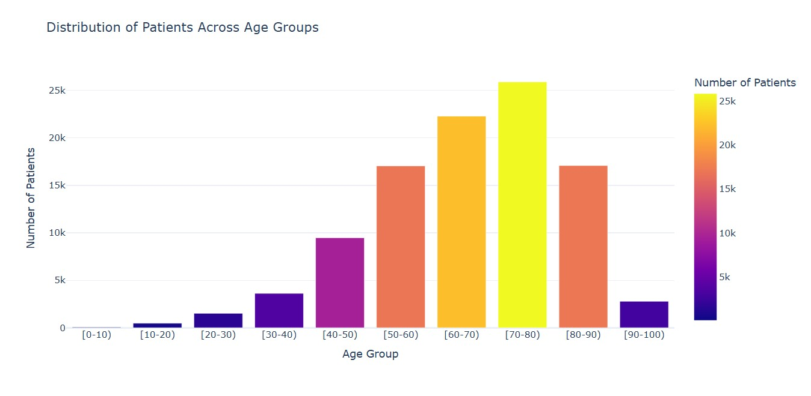

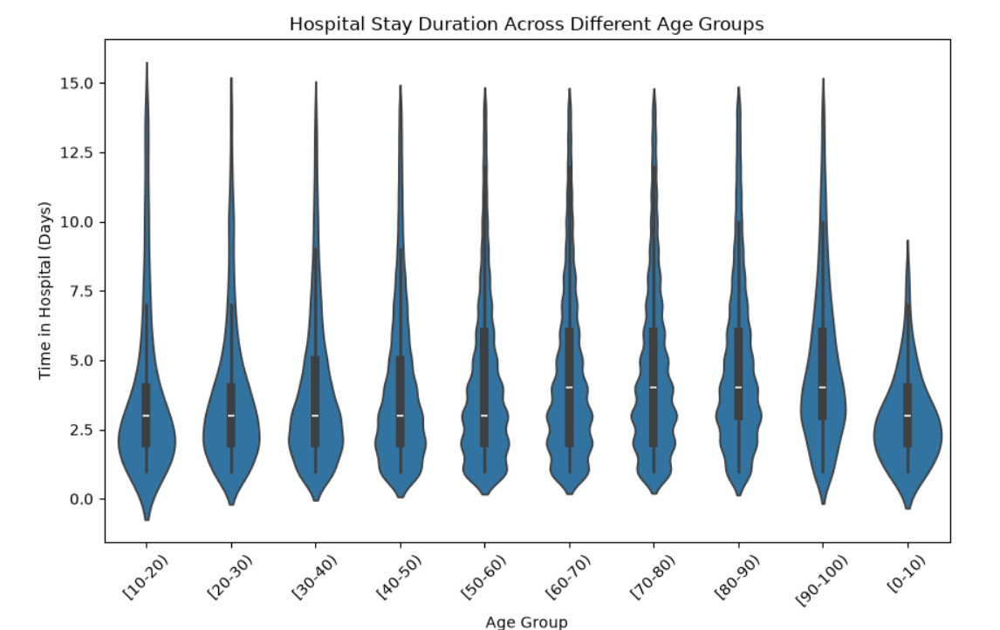

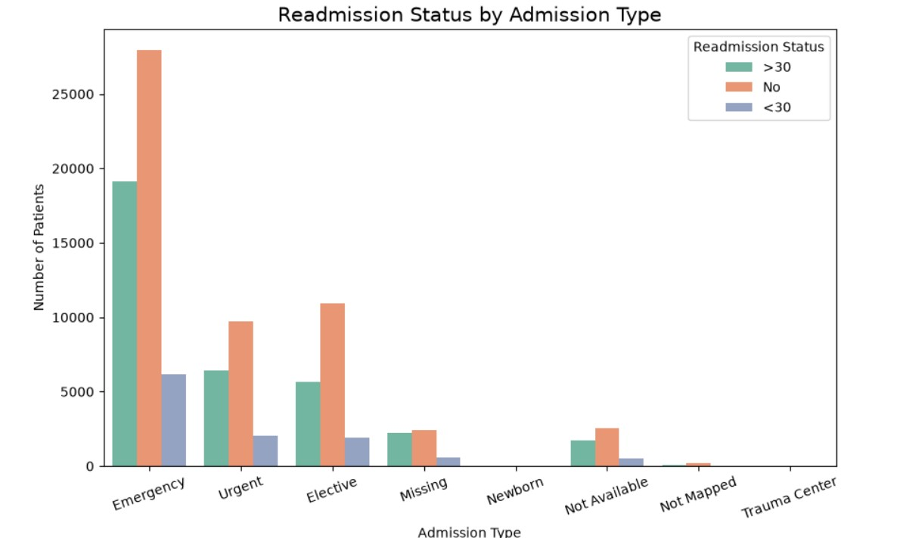

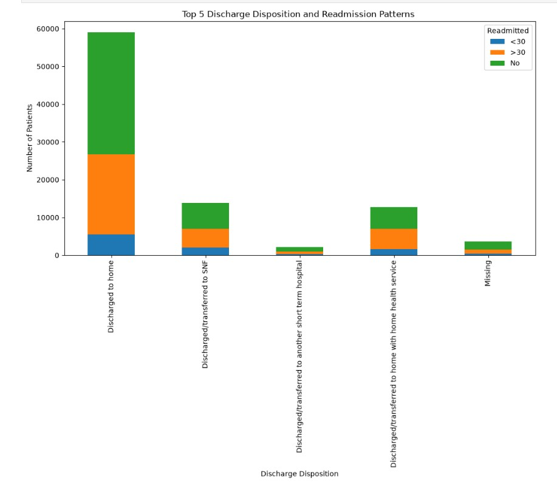

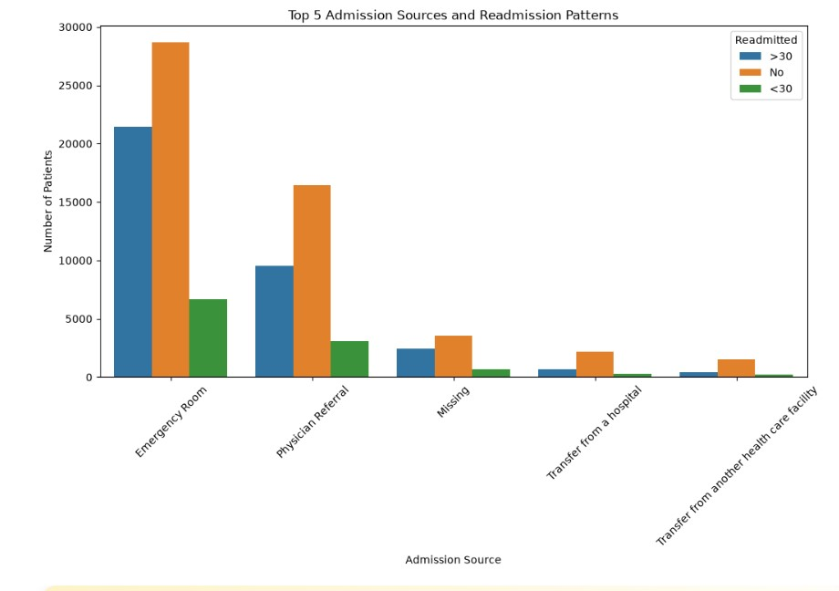

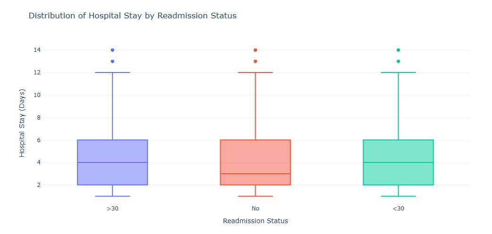

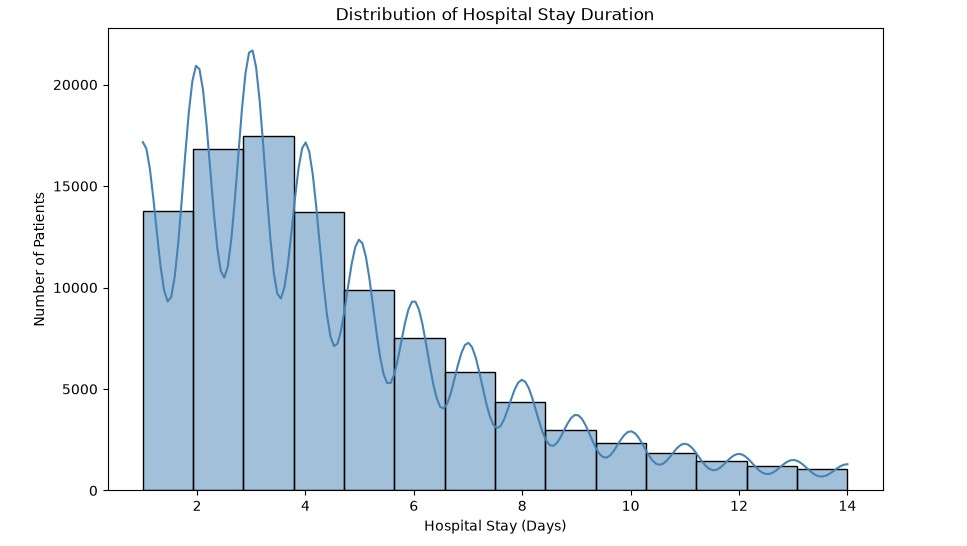

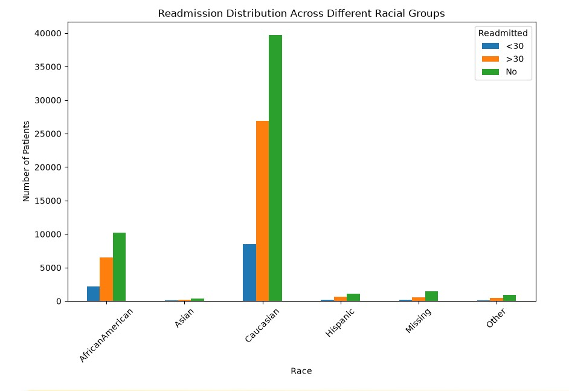

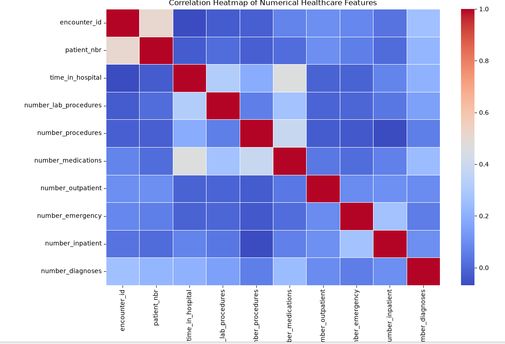

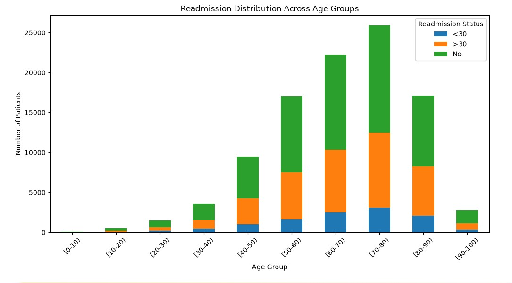

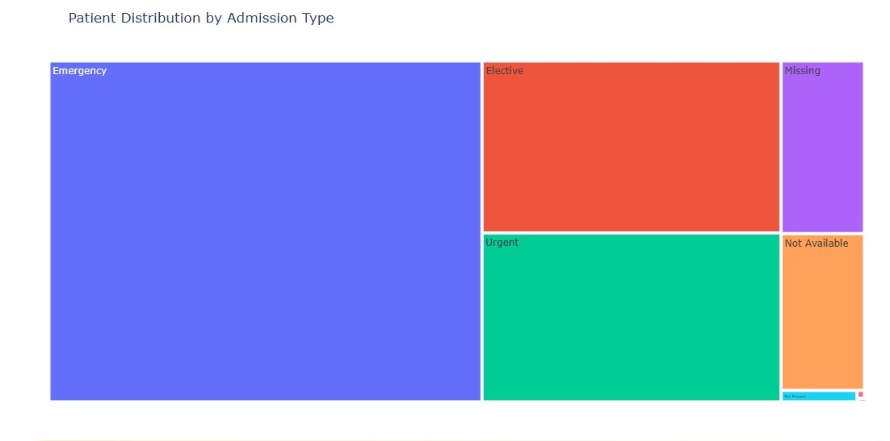

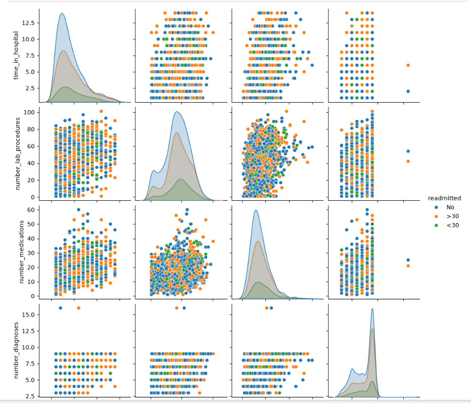

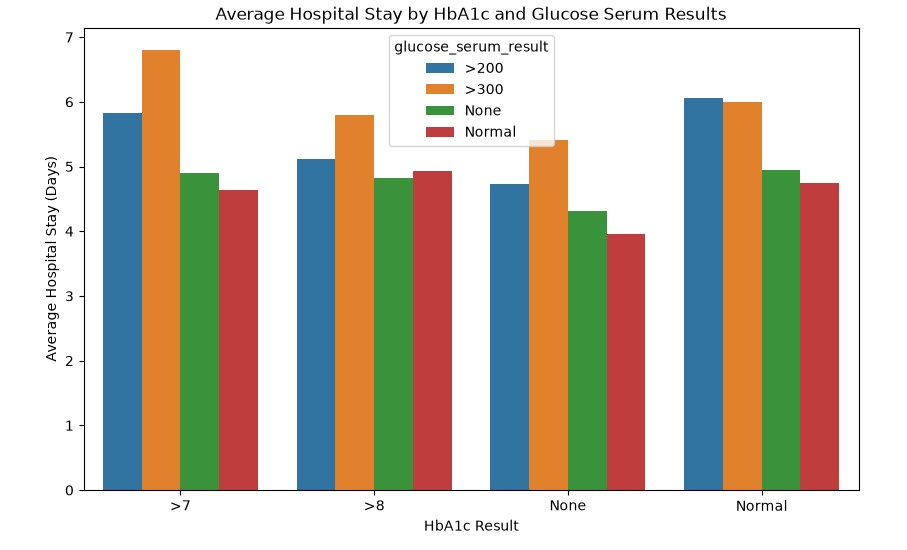

## 7. Files Included

• **diabetic_data.csv** – Raw diabetes healthcare dataset containing patient records from 130 US hospitals.

• **IDS_mapping.csv** – Mapping dataset used to convert coded values (such as admission type ID, discharge disposition ID, and admission source ID) into meaningful category names for analysis.

• **Main Project-Healthcare.ipynb** – Jupyter Notebook containing data loading, data cleaning, preprocessing, exploratory data analysis (EDA), visualizations, and insights generation using Python.

• **screenshots/** – Folder containing screenshots of visualizations created during the analysis.

• **README.md** – Project overview, objectives, analysis process, screenshots, key insights, and project documentation.

## 8. How to Use

1. Clone or download this repository to your local system.

2. Open **Main Project-Healthcare.ipynb** using **Jupyter Notebook**.

3. Ensure all required Python libraries are installed.

4. Run the notebook cells step by step to explore:
   - Data loading and preprocessing
   - Data cleaning and transformation
   - Exploratory Data Analysis (EDA)
   - Data visualizations
   - Healthcare insights and findings

5. Modify the analysis or visualizations to explore additional patterns and generate further insights from the diabetes healthcare dataset.

## 9. Conclusion

This project demonstrates how Python libraries such as **Pandas, NumPy, Matplotlib, Seaborn, and Plotly** can be effectively used for real-world healthcare data analysis. Through data cleaning, exploratory data analysis (EDA), and visualization, the project identified important patterns related to patient demographics, hospital stay duration, clinical indicators, and diabetes readmission trends.

The insights generated from this analysis can help in understanding patient hospitalization patterns and support data-driven decision-making in healthcare. This project highlights the importance of using data analytics techniques to transform raw healthcare data into meaningful insights.
